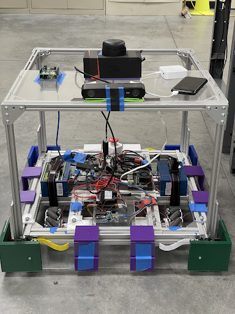

# SCU Robotics Systems Lab Senior Design Project
Senior Design Project for SCU's Robotics Systems Lab (RSL)\
------------------------------------------------------------------\
This project has developed a cobot which can autonomously navigate obstacle-filled interior environments\
such as industrial kitchens. The goal was to create the foundation for a cobot autonomous navigation system
which can be used in future RSL projects.\
------------------------------------------------------------------\
Our project titled: Autonomous and Interactive Control of a Mobile Robot won the "Best in Session" award for SCU's 2022 Senior Design Conference.\
------------------------------------------------------------------\
This repository contains the source code of the cobot, but excludes any external libraries not developed by the team.

Core Technologies:
- ZED 2i Stereo Camera
- Nvidia Jetson
- Pozyx Positioning System
- LiDAR

Team Members and Major:
- Stephen Tambussi - COEN
- Dylan Hoover - COEN
- Tanner Kaczmarek - COEN
- Kevin Molumphy - COEN

First Quarter Demo of "Follow the Leader" Mode

Final Chassis Design

